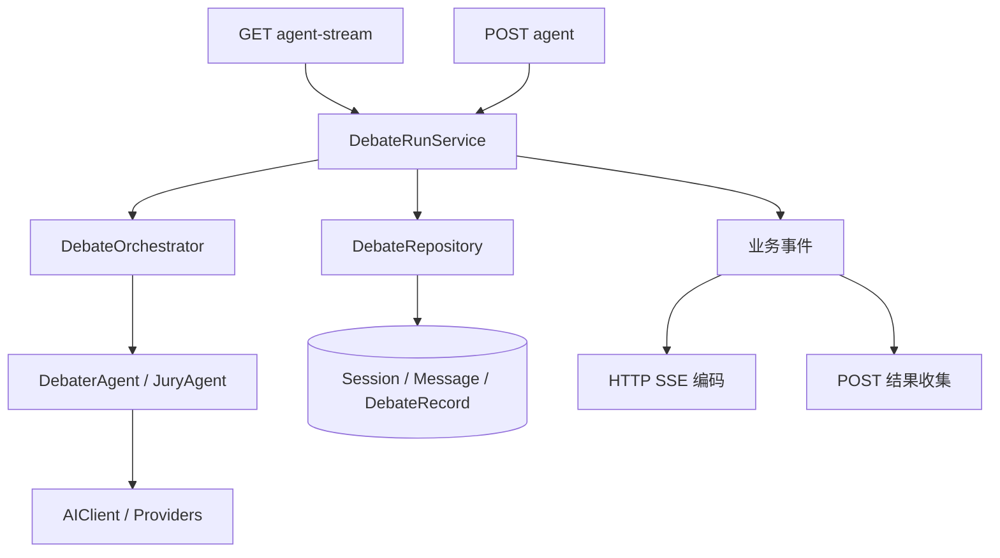

# AIgument 架构审查与重构

审查日期：2026-10-06。依据为本地源码、Git 状态和实际测试；没有调用收费模型 API。

## 判断

应该改进。项目适合继续采用模块化单体：React 前端、FastAPI 后端、SQLite 本地存储、Electron 桌面壳。主要问题是应用流程没有独立的归属，业务流程和持久化散落在 HTTP 路由中，前端视图又承担了流连接和事件处理。继续增加模式会放大这些问题。

模型适配层已有 `BaseProvider`、工厂和统一 `AIClient`，协调器已有 `BaseOrchestrator` 和规范化 `DebateEvent`，这些边界值得保留。当前桌面运行方式没有显示出需要微服务、消息队列或独立远程数据库的证据。

## 具体证据与优先级

| 优先级 | 发现 | 实际影响 | 本次处理 |
| --- | --- | --- | --- |
| 高 | `routers/debate/agent.py` 原有 320 行；GET 与 POST 分别实现会话、协调器、消息和结果保存 | POST 不保存 `DebateRecord`，分析接口无法查询其结果；两种入口的会话状态不同 | 两种入口统一调用应用服务与仓储 |
| 高 | GET 直接转发协调器的 `complete`，循环结束后才提交数据库 | 用户看到成功后，最终提交仍可能失败 | 最终状态和分析记录提交成功后才发送完成事件 |
| 高 | 完整发言暂存内存，流中断缺少取消处理 | 失败或取消时可能丢失已完成发言，会话停留在 running | 完整发言逐条提交；失败和取消分别记录状态 |
| 高 | POST 请求定义了混合模型字段，却没有创建相应客户端 | 请求被接受，实际仍使用统一模型 | GET/POST 使用同一配置和客户端创建逻辑 |
| 中 | preset 的 seed 在客户端创建后才由协调器设置；Provider 已在初始化时接收 seed | trace 中的 seed 与实际 Provider seed 可能不同 | 在创建所有客户端前解析 preset seed |
| 中 | 共用 SSE 读取器把 JSON 解析和 `onEvent` 包在一个 catch 内 | 界面事件处理失败也会被记录为解析错误并吞掉 | 按帧解析，异常向上层传播，退出时释放 reader |
| 中 | `AgentDebateView.tsx` 有 670 行，包含表单、连接、事件归约、导出和展示 | 修改协议容易影响 UI；旧请求的回调有污染新状态的风险 | 后续按 feature 拆分，尚未修改视图 |
| 中 | QA 路由 481 行，双角色和辩证法路由也管理生命周期与数据库 | 同类问题存在于其他模式；核心辩论改进没有自动覆盖它们 | 后续逐模式迁移，保留独立业务实现 |
| 中 | `Session.settings` 与 `DebateRecord` 保存重复 trace、配置和结果 | 字段演进时需要同步更新多个位置 | 本次集中在同一事务生成；存储模型尚未迁移 |
| 中 | 前端原有 interaction smoke 仅检查源码字符串 | 无法验证流解析、异常、取消和资源释放 | 增加执行真实 SSE 代码的行为测试 |
| 低 | main 模块在导入时组装全局应用与配置；后端使用顶层导入和 sys.path | 多实例测试和包化较困难 | 后续提取 app factory，保留 PyInstaller 入口兼容 |

## 本次实现的边界



- HTTP 路由负责输入验证、SSE 编码及 HTTP 错误响应，不再负责辩论持久化。
- `DebateRunService` 负责模型选择、preset seed、协调器初始化、运行和终止状态。POST 收集同一个事件流，只保留响应需要的论点、思考、评估和裁决，不收集所有增量文本。
- `DebateRepository` 负责数据库事务。完整发言独立提交；会话完成状态、最终 trace 和 `DebateRecord` 在同一事务提交。`completed_at` 同时记录。
- 协调器和 Agent 继续负责辩论业务，不依赖 FastAPI 和数据库。
- `frontend/src/utils/sse.ts` 负责增量 UTF-8 解码与 SSE 帧解析，支持跨块 CRLF、多行 data 和 reader 清理。无效 JSON 与消费回调异常会使请求失败，交给已有 API 错误回调处理。

## 行为兼容与限制

保留 API 路径、GET 参数名、POST 成功响应字段以及已有 SSE 业务事件格式。没有数据库 schema 变更，不需要迁移旧数据。正反方覆盖配置必须同时提供 provider 与非空 model；不完整配置现在返回 422，而不是静默忽略。GET 的 provider 和 temperature 验证与 POST 对齐。

取消处理覆盖服务收到 `CancelledError` 或生成器被关闭的情况。测试验证了这两个路径；尚未用真实浏览器加桌面后端验证物理断连传播。进程被强制结束、机器断电时 finally 无法执行，仍可能残留 running 会话，需要后续启动恢复策略。终止状态写入若也遇到数据库故障，只能记录日志，不能保证落盘。

失败和取消保留已完成发言，不保存完整的失败 trace；尚未完成的流式发言仍不落盘。每条完整发言增加一次提交，适合目前 1–10 轮的桌面使用范围；没有实施跨进程任务持久化或断点续跑。

共享 SSE 读取器按空行派发完整帧，丢弃 EOF 处的不完整帧。它不判断各业务模式是否必须收到 `complete`，因此应用级截断检测仍应由后续运行控制器处理。

## 下一阶段的建议顺序

1. 将前端辩论整理为一个 feature：`useDebateRun` 负责连接和取消，事件处理函数负责更新 store，表单和结果面板只负责展示。用请求编号或 controller 身份校验隔离旧请求回调，增加停止后立即重启的回归测试。
2. 将双角色对话、辩证法和苏格拉底问答的生命周期迁移到各自应用服务，复用确定相同的存储操作。先验证行为，再决定哪些职责值得抽成公共组件。
3. 明确持久化数据归属：Session 保存概要和状态，DebateRecord 保存完整辩论结果。迁移前设计旧历史兼容策略；若要恢复中断任务，再评估独立 Run/Event 表。
4. 提取 `create_app` 和可注入数据库配置，再整理 Python 包入口。同步验证开发启动和 PyInstaller 构建。
5. 产品层面将多 Agent 辩论、审计记录、评分和图谱作为主要路径；普通 Chat/QA 作为辅助入口。是否删除旧模式需要独立的产品决定。

## 验证

- 后端：112 passed，1 skipped；新增 25 个测试，覆盖两种入口、混合模型、真实协调器配合 mock Provider、持久化时序、失败事件、异常退出、缺少完成事件、取消、最终提交失败和配置校验。
- 前端：ESLint、原有 interaction smoke、6 个新增 SSE 行为测试通过。生产构建通过 TypeScript 和 Vite。
- 后端测试使用内存 SQLite 和 mock Provider；没有真实模型调用或 Windows 安装包验收。

本机沙箱会阻塞 Windows asyncio 的内部回环 socket，并限制 pnpm 依赖链接访问；后端测试和生产构建在允许这些本机访问的环境中执行。系统默认 pytest 临时目录还存在权限错误，验证使用项目内独立目录：

```powershell
# 项目根目录
npm run lint:frontend
npm run test:frontend
npm run build:frontend

# backend 目录；选一个尚不存在的临时目录名
.\venv\Scripts\python.exe -m pytest -q --basetemp=.pytest-tmp-local-review
```
